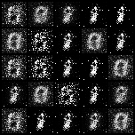
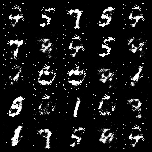
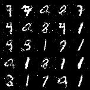
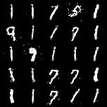
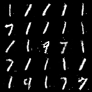

# Generative Adversarial Network (GAN) Handwriting Generator on MNIST using PyTorch

This repository implements a **Generative Adversarial Network (GAN)** from scratch using **PyTorch** to generate realistic **handwritten digit images** using the **MNIST dataset**.

---

## 🤖 What is a GAN?

A **Generative Adversarial Network (GAN)** consists of:
- A **Generator** that tries to create realistic data (images).
- A **Discriminator** that tries to distinguish between real and fake data.

Both models are trained **simultaneously** in a **minimax game**:
- The Generator learns to **fool the Discriminator**.
- The Discriminator learns to **identify fake images**.

Over time, the Generator learns to generate **realistic handwritten digit images**.

---

## 🚀 Features

✅ **Implements a fully connected GAN architecture in PyTorch.**  
✅ **Loads and preprocesses the MNIST dataset.**  
✅ **Command-line argument parsing** for flexible experimentation:
- Epochs
- Batch size
- Learning rate
- Latent dimension
- Image size and channels
- Output directory

✅ **Saves generated images at every epoch for monitoring GAN progression.**  
✅ **Generates a GIF visualizing GAN image progression during training.**  
✅ **Plots and saves Generator and Discriminator loss curves.**

---

## 🗂️ Dataset

Uses the **MNIST dataset**, consisting of:
- 60,000 training images and 10,000 test images.
- 28x28 grayscale images of handwritten digits (0-9).

Images are:
- Converted to Tensors.
- Normalized to have values in the range [-1, 1] for stable GAN training.

---

### Results

<div align="center">
  
</div>

Images generated by Generator at various epochs - 
<div align="center">

	|		|	
:----------------------------------------------------------------------:|:-------------------------------------------------------------------------:|:--------------------------------------------------------:
Generated on Epoch 120													|	Generated on Epoch 160													|	Generated on Epoch 200
	|		|	
Generated on Epoch 120													|	Generated on Epoch 160													|	Generated on Epoch 200

</div>

## 🛠️ Dependencies

- Python 3.x
- numpy
- matplotlib
- imageio
- torch
- torchvision

Install using:
```bash
pip install numpy matplotlib imageio torch torchvision
